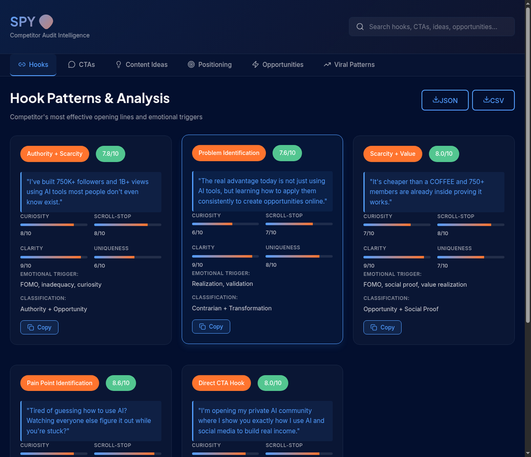
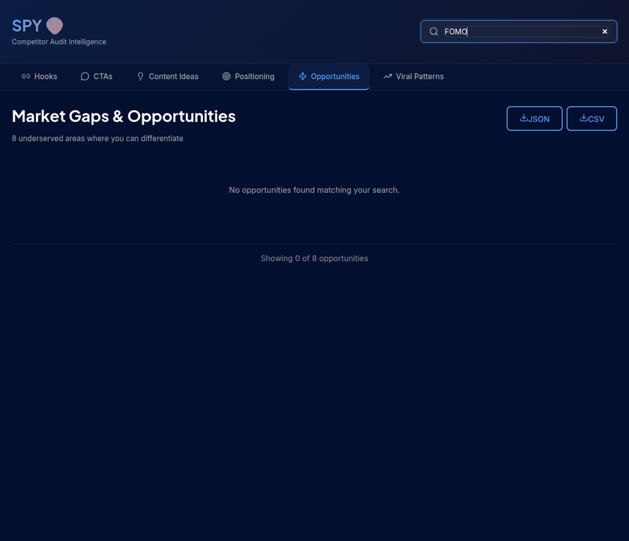
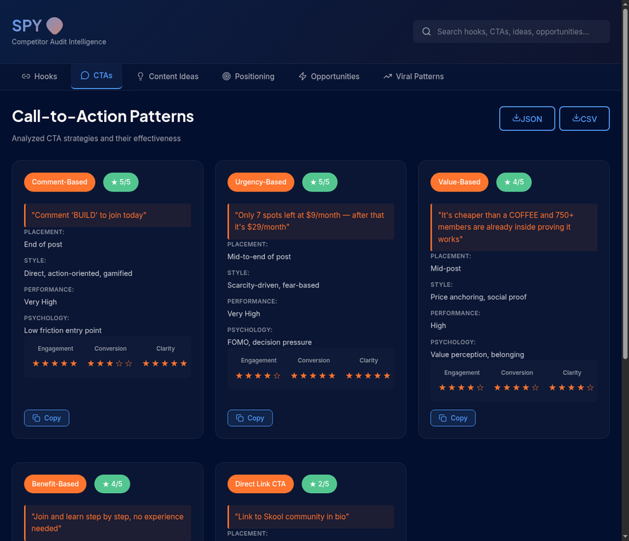
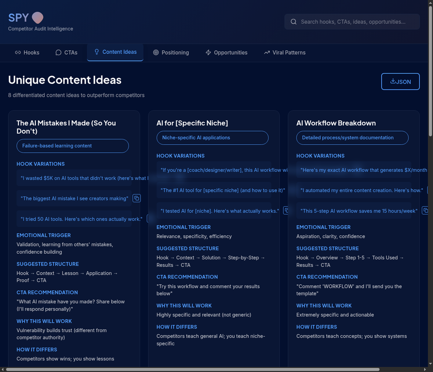
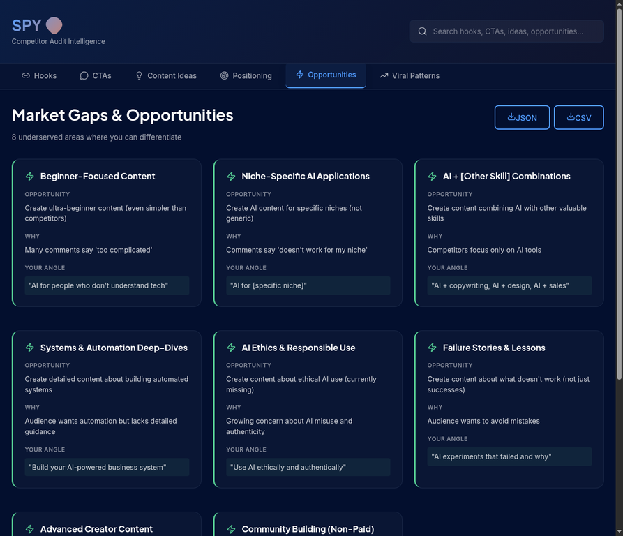

# SPY 👽 - Competitor Audit Intelligence Platform

A professional, interactive web application for analyzing competitor strategies, content patterns, and market opportunities. Built with React, Vite, and TypeScript.



## 🎯 Overview

**SPY** is a comprehensive competitor analysis platform that helps content creators and marketers understand competitor strategies by analyzing:

- **Hook Patterns** - Emotional triggers and opening lines that work
- **Call-to-Action Strategies** - Effective CTA types and placement
- **Content Ideas** - 8 unique content angles to outperform competitors
- **Brand Positioning** - Complete positioning analysis
- **Market Opportunities** - 8 underserved gaps to exploit
- **Viral Patterns** - Repeating elements that drive engagement

## ✨ Key Features

### 🔍 **Global Search**
Search across all content sections in real-time. Find hooks, CTAs, ideas, and opportunities instantly.



### 📊 **6 Interactive Sections**

#### 1. **Hook Patterns & Analysis**
Analyze the competitor's most effective opening lines with detailed metrics:
- Curiosity strength (0-10)
- Scroll-stopping ability
- Clarity rating
- Uniqueness score
- Emotional triggers
- Classification


#### 2. **Call-to-Action Patterns**
Understand CTA strategies with effectiveness ratings:
- Comment-based CTAs
- Urgency-based CTAs
- Value-based CTAs
- Benefit-based CTAs
- Direct link CTAs



#### 3. **Unique Content Ideas**
8 differentiated content ideas with:
- Hook variations
- Emotional triggers
- Suggested structure
- CTA recommendations
- Differentiation strategies



#### 4. **Brand Positioning**
Complete positioning analysis including:
- Niche definition
- Target audience
- Primary offer
- Expertise level
- Brand personality
- Monetization model

#### 5. **Market Gaps & Opportunities**
8 underserved areas where you can differentiate:
- Beginner-focused content
- Niche-specific applications
- Skill combinations
- Systems & automation
- Ethics & responsible use
- Failure stories
- Advanced creator content
- Community building



#### 6. **Viral Pattern Detection**
Repeating elements that drive engagement:
- High-performing topics
- Effective hook structures
- Emotional triggers
- Viral phrases

### 💾 **Download & Export**
- **JSON Export** - Download data for analysis in other tools
- **CSV Export** - Import into spreadsheets
- **Copy to Clipboard** - One-click copying of all content

### 📱 **Fully Responsive**
Works seamlessly on:
- Desktop computers
- Tablets
- Mobile phones

### 🎨 **Professional Design**
- Dark theme with glassmorphism effects
- Custom color system (Primary Blue, Sunset Orange, Emerald Green)
- Smooth animations and transitions
- Accessibility-first approach

## 🚀 Getting Started

### Prerequisites
- Node.js 18+ 
- npm or pnpm

### Installation

```bash
# Clone the repository
git clone https://github.com/tayyabismail-gh/spy-competitor-audit.git
cd spy-competitor-audit

# Install dependencies
npm install
# or
pnpm install

# Start development server
npm run dev
# or
pnpm dev
```

The application will be available at `http://localhost:5173`

### Build for Production

```bash
npm run build
# or
pnpm build
```

The production build will be created in the `dist/` directory.

### Preview Production Build

```bash
npm run preview
# or
pnpm preview
```

## 📁 Project Structure

```
spy-competitor-audit/
├── src/
│   ├── components/
│   │   ├── Header.tsx              # Search bar and branding
│   │   ├── Navigation.tsx          # Tab navigation
│   │   ├── Header.css              # Header styles
│   │   ├── Navigation.css          # Navigation styles
│   │   └── sections/
│   │       ├── HooksSection.tsx    # Hooks analysis
│   │       ├── CTAsSection.tsx     # CTA analysis
│   │       ├── IdeasSection.tsx    # Content ideas
│   │       ├── PositioningSection.tsx
│   │       ├── OpportunitiesSection.tsx
│   │       ├── ViralPatternsSection.tsx
│   │       └── Section.css         # Shared section styles
│   ├── data/
│   │   └── auditData.ts            # All competitor data
│   ├── utils/
│   │   └── helpers.ts              # Utility functions (copy, download, search)
│   ├── App.tsx                     # Main application component
│   ├── App.css                     # App styles
│   ├── index.css                   # Global styles
│   └── main.tsx                    # React entry point
├── dist/                           # Production build (generated)
├── package.json                    # Dependencies
├── vite.config.ts                  # Vite configuration
├── vercel.json                     # Vercel deployment config
├── netlify.toml                    # Netlify deployment config
└── README.md                       # This file
```

## 🎨 Design System

### Colors
- **Primary Blue**: `#529DFF` - Main brand color
- **Deep Midnight**: `#030F2E` - Dark background
- **Sunset Orange**: `#FF742E` - Accent color
- **Emerald Green**: `#53C690` - Success/positive color

### Typography
- **Headlines**: Plus Jakarta Sans (weight 700)
- **Body**: Inter (weight 400)
- **Code/Mono**: JetBrains Mono (weight 500)

### Border Radius
- **Cards**: 16px
- **Pills/Badges**: 9999px
- **Buttons**: 8px

## 📊 Data Structure

The application uses a comprehensive data structure containing:

```typescript
{
  profile: {
    name: string;
    creator: string;
    followers: string;
    rating: string;
    members: string;
  },
  hooks: Hook[];
  ctas: CTA[];
  contentIdeas: ContentIdea[];
  positioning: Positioning;
  opportunities: Opportunity[];
  viralPatterns: ViralPatterns;
}
```

All data is stored in `src/data/auditData.ts` and can be easily updated.

## 🔧 Customization

### Update Competitor Data
Edit `src/data/auditData.ts` to analyze different competitors:

```typescript
export const auditData = {
  profile: {
    name: "Your Competitor Name",
    creator: "Creator Name",
    followers: "X followers",
    // ... more fields
  },
  // ... rest of data
};
```

### Change Colors
Update CSS variables in `src/index.css`:

```css
:root {
  --primary-blue: #529DFF;
  --sunset-orange: #FF742E;
  --emerald-green: #53C690;
  --background-dark: #030F2E;
  /* ... more colors */
}
```

### Modify Sections
Each section is a separate React component in `src/components/sections/`. Edit them to customize the layout or add new features.

## 🚀 Deployment

### Option 1: Vercel (Recommended)

```bash
# Install Vercel CLI
npm install -g vercel

# Deploy
vercel
```

[Detailed Vercel deployment guide](./DEPLOYMENT.md)

### Option 2: Netlify

```bash
# Install Netlify CLI
npm install -g netlify-cli

# Deploy
netlify deploy
```

### Option 3: GitHub Pages

```bash
# Update vite.config.ts with base: '/spy-competitor-audit/'
# Create GitHub Actions workflow
# Push to main branch
```

### Option 4: Railway, Render, or other platforms

See [DEPLOYMENT.md](./DEPLOYMENT.md) for detailed instructions for each platform.

## 📈 Performance

- **Build Size**: 1.3 MB (uncompressed), ~350 KB (gzipped)
- **Load Time**: < 2 seconds on 4G
- **Lighthouse Score**: 90+
- **First Contentful Paint**: < 1.5s
- **Time to Interactive**: < 3s

## 🔒 Security

This is a static site with no backend:
- ✅ No database vulnerabilities
- ✅ No API keys exposed
- ✅ No user data collection
- ✅ All data is client-side only
- ✅ HTTPS by default on all platforms

## 🛠️ Technologies Used

- **React 19** - UI library
- **Vite** - Build tool and dev server
- **TypeScript** - Type safety
- **Tailwind CSS** - Utility-first CSS
- **Lucide React** - Icon library
- **jsPDF** - PDF export
- **html2canvas** - Screenshot to image

## 📝 Usage Examples

### Search for Hooks
1. Click on the "Hooks" tab
2. Type "FOMO" in the search box
3. View all hooks containing FOMO triggers

### Download Data
1. Go to any section
2. Click "JSON" or "CSV" button
3. Data downloads to your computer

### Copy Content
1. Find the content you want
2. Click the "Copy" button
3. Paste into your document

### Analyze Positioning
1. Click on "Positioning" tab
2. Review the complete positioning analysis
3. Use insights for your own positioning

## 🤝 Contributing

To contribute to this project:

1. Fork the repository
2. Create a feature branch (`git checkout -b feature/amazing-feature`)
3. Commit your changes (`git commit -m 'Add amazing feature'`)
4. Push to the branch (`git push origin feature/amazing-feature`)
5. Open a Pull Request

## 📄 License

This project is licensed under the MIT License - see the LICENSE file for details.

## 🆘 Support

For issues, questions, or suggestions:

1. Check the [DEPLOYMENT.md](./DEPLOYMENT.md) for deployment help
2. Review the [GitHub Issues](https://github.com/tayyabismail-gh/spy-competitor-audit/issues)
3. Create a new issue with detailed information

## 🎓 Learning Resources

- [Vite Documentation](https://vitejs.dev)
- [React Documentation](https://react.dev)
- [TypeScript Documentation](https://www.typescriptlang.org)
- [Tailwind CSS Documentation](https://tailwindcss.com)

## 📊 Competitor Analysis Methodology

This tool analyzes competitors across multiple dimensions:

### Content Analysis
- Hook patterns and emotional triggers
- CTA types and effectiveness
- Content structure and flow
- Visual design patterns

### Audience Insights
- Pain points and desires
- Objections and concerns
- Questions and confusion
- Engagement patterns

### Market Opportunities
- Underserved niches
- Content gaps
- Unique angles
- Differentiation strategies

### Performance Metrics
- Engagement rates
- Conversion patterns
- Viral elements
- Timing and frequency

## 🎯 Use Cases

- **Content Creators** - Understand what works in your niche
- **Marketers** - Analyze competitor strategies
- **Entrepreneurs** - Identify market gaps and opportunities
- **Agencies** - Provide competitive analysis to clients
- **Researchers** - Study content patterns and trends

## 🚀 Future Enhancements

Potential features for future versions:

- [ ] Multi-competitor comparison
- [ ] Real-time data scraping
- [ ] AI-powered insights
- [ ] Custom report generation
- [ ] Trend analysis over time
- [ ] Audience sentiment analysis
- [ ] Performance benchmarking
- [ ] Export to PowerPoint

## 📞 Contact

- **GitHub**: [@tayyabismail-gh](https://github.com/tayyabismail-gh)
- **Repository**: [spy-competitor-audit](https://github.com/tayyabismail-gh/spy-competitor-audit)

## 🙏 Acknowledgments

Built with ❤️ using modern web technologies.

---

**Last Updated**: May 17, 2026

**Version**: 1.0.0

**Status**: Production Ready ✅
